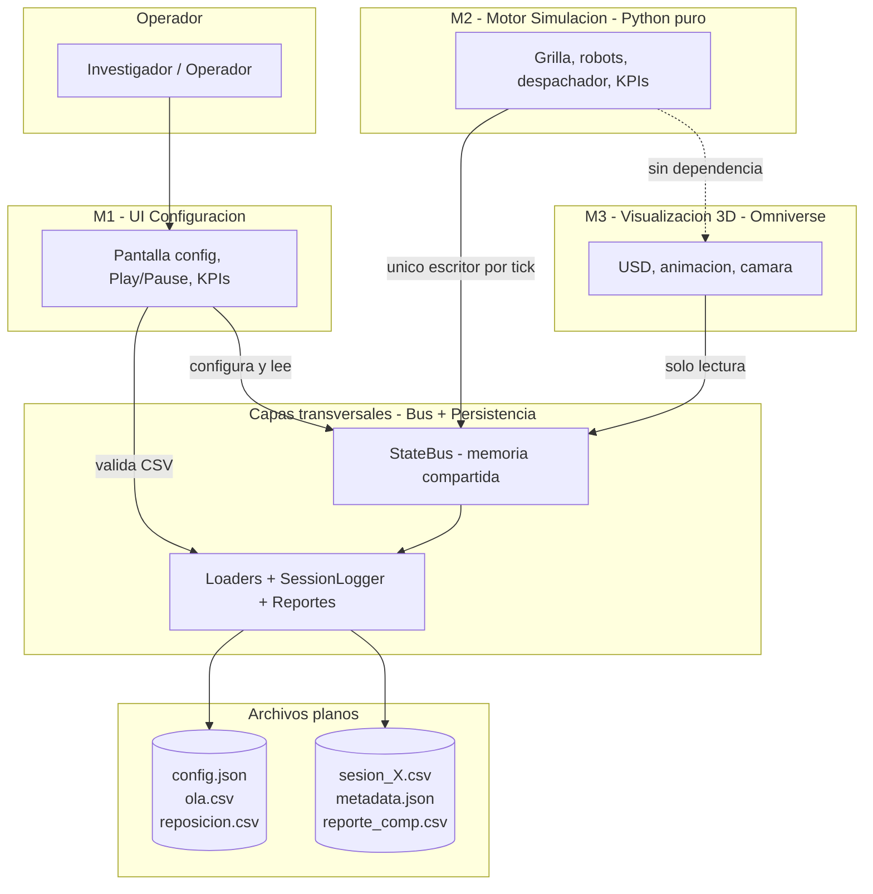
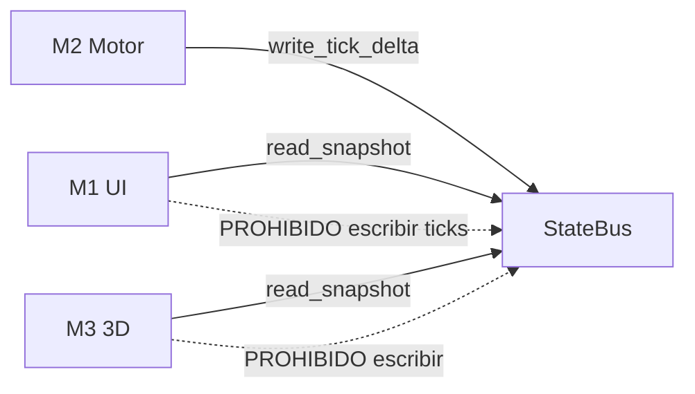
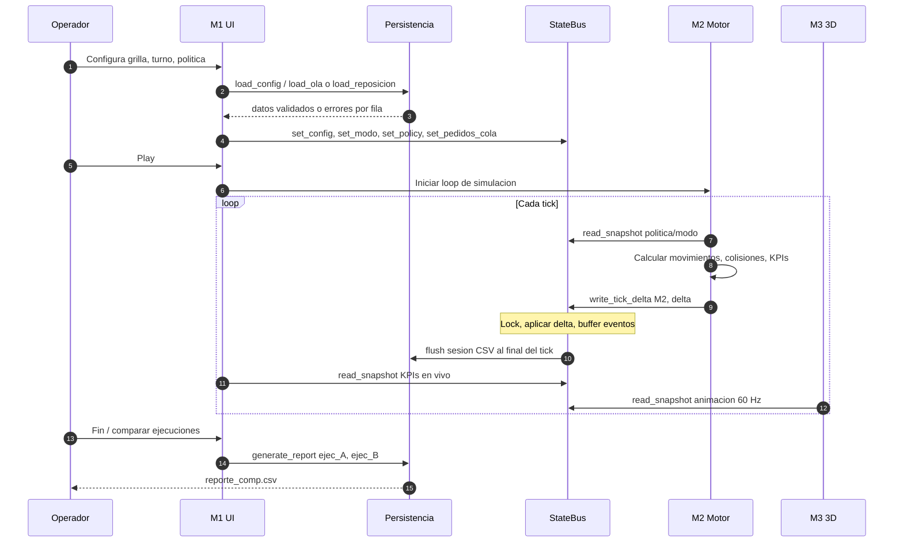
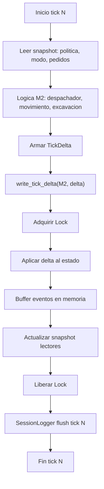
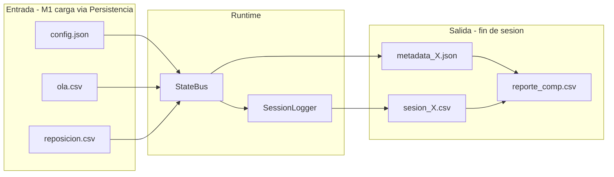
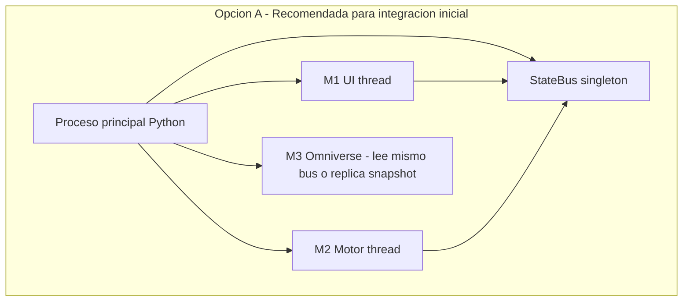

# Diagrama de integración — Simulador AutoStore (Grupo 12)

Documento para alinear al equipo M1, M2, M3 y Bus + Persistencia sobre **cómo se conectan los módulos**.

**Responsables Bus + Persistencia:** Martín Vásquez, Guadalupe Marín  
**Contrato técnico detallado:** [bus_api.md](bus_api.md)

---

## 1. Arquitectura general

El simulador replica el almacén AutoStore de Forus S.A.: grilla 3D, robots, picking diurno y reposición nocturna. La solución se divide en **3 módulos funcionales** y **2 capas transversales**.



**Principio clave:** M2 no depende de Omniverse. Si M3 falla, M2 sigue calculando ticks y generando `sesion_X.csv`.

---

## 2. Roles por módulo

| Módulo | Equipo | Escribe en Bus | Lee del Bus | Archivos |
|--------|--------|----------------|-------------|----------|
| **M1** UI | Alonso, Eliseo | Config, modo, política, pedidos (antes de Play) | KPIs, tick, estado | Usa `load_config`, `load_ola`, `load_reposicion` |
| **M2** Motor | Manuel, Vicente | **Todo el estado por tick** (grilla, robots, KPIs, eventos) | Política, modo, pedidos al inicio de tick | Emite eventos → `sesion_X.csv` |
| **M3** 3D | Alex, Samira | — | Grilla, robots, tick | — |
| **Bus + Persistencia** | Martín, Guadalupe | — (infraestructura) | — | Entrada/salida CSV y JSON |

---

## 3. Reglas del Bus (obligatorias)



| Regla | Detalle |
|-------|---------|
| Single-writer | Solo M2 llama `write_tick_delta("M2", delta)` |
| Multiple-reader | M1 y M3 llaman `read_snapshot()` (copia inmutable) |
| Escritura delta | M2 envía solo campos que cambiaron en ese tick |
| Concurrencia | Escritura protegida con `threading.Lock()` |
| Latencia | Objetivo P99 escritura < 1 ms |

---

## 4. Flujo de una simulación completa



---

## 5. Ciclo de un tick (vista M2)



---

## 6. Cómo conecta cada equipo (código mínimo)

### M1 — antes de Play

```python
from bus_persistencia import StateBus
from bus_persistencia.models.state import ModoTurno, PoliticaPicking
from bus_persistencia.persistence import load_config, load_ola, load_reposicion

bus = StateBus()  # instancia compartida del proceso

cfg = load_config("data/config.json")
if not cfg.is_valid:
    # mostrar error al usuario
    ...
else:
    bus.set_config(cfg.data)

if modo_diurno:
    ola = load_ola("data/ola.csv")
    if ola.is_valid:
        bus.set_pedidos_cola(ola.data)
else:
    rep = load_reposicion("data/reposicion.csv")
    ...

bus.set_modo(ModoTurno.DIURNO)
bus.set_policy(PoliticaPicking.FIFO)
```

### M1 — panel KPIs en vivo

```python
snap = bus.read_snapshot()
tsp = snap.kpis.TSP
tick_actual = snap.tick
```

### M2 — cada tick

```python
from bus_persistencia.bus.state_bus import M2_WRITER_ID
from bus_persistencia.models.state import TickDelta, KPISet

snap = bus.read_snapshot()
# usar snap.politica, snap.pedidos, snap.config

delta = TickDelta(
    grilla_delta=[...],
    robots_delta=[...],
    kpis=KPISet(TSP=95.0, IOG=72.0, ...),
    eventos=[
        {"tipo": "movimiento", "robot_id": 1, ...},
        {"tipo": "pedido_completado", "id_pedido": "P001"},
    ],
)
tick = bus.write_tick_delta(M2_WRITER_ID, delta)
```

### M3 — loop render

```python
snap = bus.read_snapshot()
for caja in snap.grilla:
    # actualizar USD en (caja.x, caja.y, caja.z)
for robot in snap.robots:
    # interpolar posicion entre snap.tick y frame anterior
```

---

## 7. Flujo de archivos



| Archivo | Columnas / contenido |
|---------|----------------------|
| `config.json` | grilla.{x,y,z}, robots, ocupacion_inicial |
| `ola.csv` | id_pedido, id_sku, cantidad, destino |
| `reposicion.csv` | id_caja, id_sku, cantidad |
| `sesion_X.csv` | timestamp, tick, tipo_evento, payload_json |
| `metadata_X.json` | semilla, hashes, modo, politica, kpis_finales |
| `reporte_comp.csv` | KPI, Ejecucion_A, Ejecucion_B, Delta_% |

**Eventos que M2 debe registrar:** `movimiento`, `caja_recuperada`, `pedido_completado`, `excavacion`, `bloqueo`, `kpi_update`.

---

## 8. Instancia compartida del Bus

Hoy la implementación es **in-process** (mismo proceso Python, objeto en memoria).



**Acuerdo pendiente con el grupo:** quién crea `StateBus()` y cómo lo reciben M2 y M3 si corren en procesos separados (IPC futuro).

---

## 9. Qué desbloquea Bus + Persistencia

| Tarea | Equipos que dependen |
|-------|---------------------|
| T-01 Bus | M2 T-09, M1 T-24, M3 T-32 |
| T-02 Concurrencia | M1 T-27 Play/Pause |
| T-03–05 Validadores | M1 T-25, T-29 |
| T-06 SessionLogger | M2 T-21 logging |
| T-07 Reporte | M1 T-31 nombre ejecución |
| T-08 Semilla | RNF-04 reproducibilidad |

---

## 10. Demo de integración (ya disponible)

Para probar el flujo sin esperar a M2/M3 reales:

```bash
cd autostore-sim
pytest                                    # 28 tests
python -m bus_persistencia.integration    # mock M1+M2+M3
```

Código de referencia: `bus_persistencia/integration/mock_modules.py`

---

## 11. Checklist reunión de integración

- [ ] Acordar quién instancia `StateBus` y dónde vive
- [ ] M1 confirma uso de `load_config`, `load_ola`, `load_reposicion` (no parsear CSV propio)
- [ ] M2 confirma formato de `TickDelta` y tipos de evento
- [ ] M3 confirma lectura de `read_snapshot()` e interpolación por tick
- [ ] Definir valores por defecto Forus (grilla 10×10×5, 4 robots, 70% ocupación)
- [ ] Probar demo: `python -m bus_persistencia.integration`
- [ ] Revisar [bus_api.md](bus_api.md) y marcar dudas

---

## 12. Contacto módulo Bus + Persistencia

- **API:** `docs/bus_api.md`
- **Tests:** `bus_persistencia/tests/` (P01, P02, P05, P10)
- **Mocks:** `bus_persistencia/integration/mock_modules.py`
